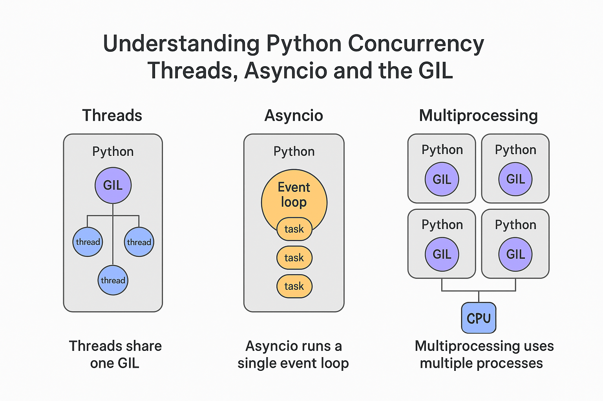

# 🧠 Understanding Python Concurrency: Threads, Asyncio, and the GIL

> A clear, practical explanation of how Python handles concurrency — and when to use threads, asyncio, or multiprocessing.
> 

---

## ⚙️ The Big Picture

Python’s concurrency model revolves around something called the **Global Interpreter Lock (GIL)**.  
The GIL ensures that only **one thread executes Python bytecode at a time**, even on multi-core CPUs.

> 🧩 **One Python process = One GIL = One CPU core of execution at a time**

However, not all types of workloads behave the same way.  
Let’s first distinguish between **I/O-bound** and **CPU-bound** work.

---

## 🚦 Two Types of Workloads

| Type | What’s happening | Example |
|------|------------------|----------|
| **I/O-bound** | Waiting for something external (disk, network, database) | Reading files, sending API requests |
| **CPU-bound** | Actively crunching data on the CPU | Image resizing, encryption, data compression |

These categories determine which concurrency model fits best.

---

## 🧵 Multithreading

Threads let Python run multiple tasks *apparently* at once — but only one thread can hold the GIL at a time.

### ✅ Great for I/O-bound tasks
When a thread is waiting for I/O (e.g., network or disk), the GIL is released, allowing another thread to run.

```python
import threading
import requests

def download(url):
    print("Downloading", url)
    res = requests.get(url)
    print("Done:", url)

urls = ["https://example.com/a", "https://example.com/b"]
threads = [threading.Thread(target=download, args=(u,)) for u in urls]

for t in threads:
    t.start()
for t in threads:
    t.join()
```

🟢 Efficient when threads are *waiting* (not working).

### ❌ Bad for CPU-bound tasks
CPU-heavy work keeps the GIL locked, so threads run sequentially — no true parallelism.

---

## ⚡ Asyncio

`asyncio` uses **an event loop** to run many coroutines on a single thread.  
Tasks yield control (`await`) whenever they’re waiting (like a non-blocking sleep or I/O call).

```python
import asyncio

async def fetch(url):
    print("Fetching", url)
    await asyncio.sleep(2)  # simulate I/O
    print("Done:", url)

async def main():
    await asyncio.gather(fetch("A"), fetch("B"))

asyncio.run(main())
```

🟢 Excellent for **massive I/O concurrency** (web servers, APIs, sockets).  
🔴 Not for **CPU-heavy** workloads — they block the event loop.

---

## 🧮 Multiprocessing

`multiprocessing` bypasses the GIL by spawning **separate processes**, each with its own Python interpreter and memory space.  
This enables **true parallelism** across CPU cores.

```python
from multiprocessing import Pool

def cpu_heavy(n):
    count = 0
    for i in range(n):
        count += i * i
    return count

with Pool(processes=4) as pool:
    pool.map(cpu_heavy, [10_000_000] * 4)
```

🟢 Perfect for CPU-bound work (computation, ML, image processing).  
🔴 More overhead — each process has its own memory and startup cost.

---

## 🧩 Comparison Summary

| Type of Work | Best Choice | Why |
|---------------|--------------|------|
| Network / Disk I/O | **Asyncio** | Non-blocking, lightweight, scalable |
| Blocking I/O (old libs) | **Threads** | Works with synchronous code |
| CPU-heavy work | **Multiprocessing** | True parallelism using multiple cores |
| Background tasks | **Threads** | Simpler and lightweight |

---

## 🧠 Rule of Thumb

> - **Asyncio** → When you’re *waiting* on I/O.  
> - **Threads** → When you’re *blocked* on I/O.  
> - **Processes** → When you’re *crunching* with the CPU.

---

## 🖼️ Visual Summary

<p align="center">
  
</p>

| Model | Key Concept | Description |
|--------|--------------|-------------|
| **Threads** | Shared GIL | Multiple threads, one interpreter |
| **Asyncio** | Event Loop | Single thread, cooperative multitasking |
| **Multiprocessing** | Multiple Processes | Each process has its own GIL and CPU core |

---

## 🚀 Final Thoughts

Python’s concurrency story isn’t about which method is *better*, but **when to use each**:

- **Asyncio** for high-scale network I/O  
- **Threads** for blocking I/O or legacy code  
- **Multiprocessing** for heavy computation  

Even with the GIL, Python can still build fast, scalable, and concurrent systems when used smartly.
